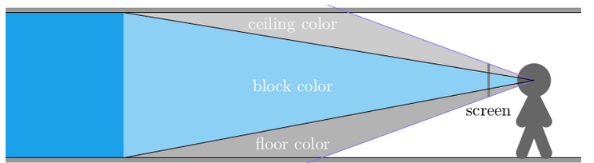
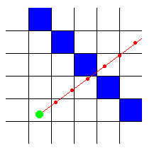
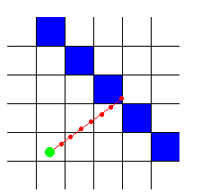

*This project has been created as part of the 42 curriculum by pifourni and sbrochar.*

# Cube3D

## Description

Cube3D is a first-person 3D rendering project built in C as part of the 42 curriculum.
It uses a classic raycasting approach with MiniLibX to project a 2D grid map into a pseudo-3D scene, including wall-slice rendering, face-based wall coloring, and basic floor/ceiling drawing.
The project is currently in a prototype stage, with rendering logic in place and parser/game features to be expanded.

## Instructions

To build the project make install those librairies: \
`sudo apt update && sudo apt install xorg libxext-dev zlib1g-dev libbsd-dev`
They are needed for the compilation of the minilibx. Then `make` and you can launch the game with `./cub3D`

### Map

The map must end in `.cub` here is a valid map :

```sh
NO ./path_to_the_north_texture
SO ./path_to_the_south_texture
WE ./path_to_the_west_texture
EA ./path_to_the_east_texture
F 220,100,0
C 225,30,0
        1111111111111111111111111
        1000000000110000000000001
        1011000001110000000000001
        1001000000000000000000001
111111111011000001110000000000001
100000000011000001110111111111111
11110111111111011100000010001
11110111111111011101010010001
11000000110101011100000010001
10000000000000001100000010001
10000000000000001101010010001
11000001110101011111011110N0111
11110111 1110101 101111010001
11111111 1111111 111111111111
```

## Raycating explanation

### Definition

Ray casting is a rendering technique where you shoot one ray per screen column from the player/camera into a 2D map to find the first wall hit, then use that hit distance to draw a vertical wall slice with the correct height.

In short:

Closer hit = taller wall slice
Farther hit = shorter wall slice

### How it works

first of all the map is in 2D so when on the camera we can divide what the player see in 3 zones.



For each column of the screen we are going to calculate where the limit between the ceilong and the wall is and same for the wall and the floor.
It give us the following equation

$y_{lo} = \frac{SCREEN\_HEIGHT - TILE\_SIZE}{2} \cdot \frac{projdist}{perpdist}\\$

$y_{hi} = \frac{SCREEN\_HEIGHT + TILE\_SIZE}{2} \cdot \frac{projdist}{perpdist}$

Where $projdist$ is the distance bettween the projection plane(screen in fig1) and the camera.

So $projdist$ is a constant equal to:

$projdist = \frac{SCREEN\_WIDTH}{ 2 \cdot \tan(\frac{fov}{2})}$

$perpdist$ is the distance of the wall with a correction to not have distortion (fish eye correction).

$perpdist = ray\_len \cdot \cos(ray\_angle - p\_angle)$

$p\_angle$ is the the angle of where the player is looking.

$ray\_angle$ is the current angle of the ray for the $i$ screen column. It give us the followig equation.

$ray\_angle = p\_angle + \arctan(c_x \cdot \tan(\frac{fov}{2}))$

Whit $c_x$ the camera plane x coordinate for the current ray:
$c_x = \frac{2(i + 0.5)}{SCREEN\_WIDTH - 1}$

### Shoot rays

Now all we ahve to do it to shoot a ray and return the distance of where it met the wall.

To do so we appl ythe following idea:

To find the first wall that a ray encounters on its way, you have to let it start at the player's position, and then all the time, check whether or not the ray is inside a wall.

A human can immediatly see where the ray hits the wall, but it's impossible to find which square the ray hits immediatly with a single formula, because a computer can only check a finite number of positions on the ray. Many raycasters add a constant value to the ray each step, but then there's a chance that it may miss a wall! For example, with this red ray, its position was checked at every red spot:



To avoid that we can define a smaller step as we can see bellow.



The basics information we need to 'shoot' the ray is the angle of it and the player coordinate.

We calculate the direction vector of the ray by converting the ray angle into x and y components:

$dir_x = \cos(ray\_angle)\\$
$dir_y = \sin(ray\_angle)$

and respectively $ray_x, ray_y$ the current position where we check if there is a wall. They start at the play current position.

Then while we don't meet a wall wall we update $ray_x, ray_y$

$ray_x = dir_x \cdot step\\$
$ray_y = dir_y \cdot step$

they to get the current position in the map all we need to do is

$map_x = \frac{ray_x}{TILE\_SIZE}\\$
$map_y = \frac{ray_y}{TILE\_SIZE}$

if the value of $map_x, map_y$ are out of bound it means we did not meet any wall thus the distance return is `INFINITY`¹. If it's not out of bound 2 cases we have met a wall.

In this case we return the following:

$\sqrt{d_x² + d_y²}$

Where $d_x$ and $d_y$ are\
$d_x = ray_x - p_x\\$
$d_x = ray_y - p_y\\$
$p_x, p_y$ the position of the player

### Find the Face

A something require to do in the project is to know wich face for the wall we are facing.

To do that we compare the stating position of the rays to the position where we hit a wall.

So:

1. `map_x != prev_x` :
    1. `dir_x > 0` -> West face
    2. `dir_x <= 0` -> East face
2. `map_y != prev_y`
    1. `dir_y > 0` -> North face
    2. `dir_y <= 0` -> South face

With `prev_x` qnd `prev_y` the init coordinate of the player in the map.

## Ressources

https://lodev.org/cgtutor/raycasting.html \
https://timallanwheeler.com/blog/2023/04/01/wolfenstein-3d-raycasting-in-c/ \
https://harm-smits.github.io/42docs/libs/minilibx

## Annex

¹: The INFINITY macro represents positive floating-point infinity and evaluates to a constant expression of type float. It is implemented using the compiler built-in function __builtin_inff().
