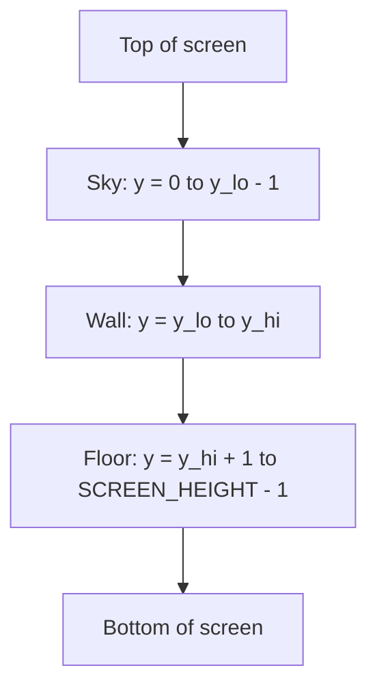

# Cube3D

## Ray Casting

### Projection Plane

A projection plane is an imaginary flat surface placed in front of the camera/player where the 3D world is “projected” into a 2D image.
It gives a mathematically consistent way to turn distance into pixel height.
It ties together FOV, screen width, and perspective with:

$$
\displaystyle projdist = \frac{SCREEN\_WIDTH}{2*\tan(\frac{FOV}{2})}
$$

Fish-eye correction uses:

$$
\displaystyle perpdist = ray\_len * \cos(ray\_angle - p\_angle)
$$

Definition: `perpdist` is the perpendicular distance from the player camera direction to the wall hit point.

Explanation: `ray_len` is the raw length of the ray, but side rays are naturally longer than center rays even when they hit a wall at the same depth. This creates the fish-eye effect. Multiplying by `cos(ray_angle - p_angle)` projects the raw distance onto the player forward axis, giving the corrected depth used to compute wall height on screen.

### 1) Big Picture

Your world is a 2D grid map:

- `1` = wall
- `0` = empty space
- `P` = player start tile

Raycasting takes this flat map and draws a **fake 3D view** by doing this for every vertical screen column:

1. Shoot one ray from the player.
2. Find where it hits a wall.
3. Use hit distance to decide wall height:
   - close wall => tall slice
   - far wall => short slice
4. Draw sky, wall slice, and floor for that column.

Doing this hundreds of times (one per column) creates the full frame.

---

## 2) The Core Idea

Think of standing in a hallway with a flashlight that sweeps from left to right.
Each flashlight beam is one ray.

- If a beam hits a nearby wall, that wall looks big on screen.
- If a beam hits a far wall, that wall looks small.

Your code repeats this from the left pixel column to the right pixel column.

---

## 3) What Happens In Your Code

### Constants and setup

You define screen/map sizes and tile size:

- `MAP_WIDTH`, `MAP_HEIGHT`
- `SCREEN_WIDTH`, `SCREEN_HEIGHT`
- `TILE_SIZE`

---

## 4) `ray_dist(...)`: How one ray finds a wall

Function: `double ray_dist(t_cordinate p, double ray_angle, char **map, int *face)`

This function returns the distance from player to the first wall hit by that ray.

Step by step:

1. Convert angle to direction vector: $$dir\_x = \cos(ray\_angle), \quad dir\_y = \sin(ray\_angle)$$
2. Start ray at player position (`ray_x`, `ray_y`).
3. Move forward by tiny steps (`step = 0.01`) in a loop.
4. Convert world position to map cell:$$map\_x = \left\lfloor \frac{ray\_x}{TILE\_SIZE} \right\rfloor, \quad map\_y = \left\lfloor \frac{ray\_y}{TILE\_SIZE} \right\rfloor$$
5. If outside map => return `INFINITY`.
6. If cell is `'1'` => wall found:
   - detect wall face (`N/S/E/W`) based on which cell boundary was crossed
   - compute Euclidean distance and return it:

$$
distance = \sqrt{(ray\_x - p\_x)^2 + (ray\_y - p\_y)^2}
$$

So `ray_dist` is your “collision scanner” for one ray.

---

## 5) `render(...)`: How a full 3D frame is built

Function: `void render(t_data *img, char **map, t_cordinate player_pos, double fov)`

The loop `while (i < SCREEN_WIDTH)` means:

- one iteration = one screen column
- `i` goes from left edge to right edge

For each column:

1. Compute camera-space x (`c_x`) in range about $[-1, 1]$:

$$
c\_x = 2 \cdot \frac{i + 0.5}{SCREEN\_WIDTH} - 1
$$

2. Convert it to a ray angle inside FOV:

$$
ray\_angle = p\_angle + \arctan\left(c\_x \cdot \tan\left(\frac{fov}{2}\right)\right)
$$

3. Get raw ray hit distance:
   - `ray_len = ray_dist(...)`
4. Compute projection-plane distance:

$
\displaystyle projdist = \frac{SCREEN\_WIDTH}{2*\tan(\frac{FOV}{2})}
$

5. Correct fish-eye:

$$
perpdist = ray\_len \cdot \cos(ray\_angle - p\_angle)
$$

6. Compute projected wall top/bottom on screen:

$$
y\_lo = \frac{SCREEN\_HEIGHT - TILE\_SIZE}{2} \cdot \frac{projdist}{perpdist}
$$

$$
y\_hi = \frac{SCREEN\_HEIGHT + TILE\_SIZE}{2} \cdot \frac{projdist}{perpdist}
$$
7. Choose wall color from hit face.
8. Draw:
   - sky from `0` to `y_lo - 1`
   - wall from `y_lo` to `y_hi`
   - floor from `y_hi + 1` to bottom

That is the complete frame pipeline.

### Magic numbers explained (from your current `render.c`)

Below are the hard-coded values that may look "magic", and what each one means.

- In $c\_x = 2 \cdot \frac{i + 0.5}{SCREEN\_WIDTH} - 1$:
	- $2$: scales $[0,1]$ into $[0,2]$.
	- $0.5$: samples at pixel center (not pixel edge).
	- $-1$: shifts $[0,2]$ into $[-1,1]$.

- In $ray\_angle = p\_angle + \arctan\left(c\_x \cdot \tan\left(\frac{fov}{2}\right)\right)$:
	- $2$ in $\frac{fov}{2}$: half-FOV from center to left/right edge.

- In $\displaystyle projdist = \frac{SCREEN\_WIDTH}{2*\tan(\frac{FOV}{2})}$:
	- $2$ in $\frac{SCREEN\_WIDTH}{2}$: half-screen width from center to one side.

- In wall bounds:
	- $\frac{SCREEN\_HEIGHT}{2}$: vertical center of screen (horizon line).
	- $\frac{TILE\_SIZE}{2}$: half wall unit around center camera height.

- In fish-eye safety clamp:
	- if $perpdist < 0.0001$, force $perpdist = 0.001$.
	- These tiny values prevent division by zero and giant unstable wall heights.

- In ray marching:
	- $step = 0.01$: ray movement per loop in world units.
	- Smaller step = better precision, slower performance.

- In FOV setup:
	- $fov = 60 \cdot \frac{\pi}{180}$ converts $60^\circ$ to radians.
	- $180$ appears because degrees-to-radians is $\theta\_{rad} = \theta\_{deg} \cdot \frac{\pi}{180}$.

- In player angle and spawn:
	- $p\_angle = -\frac{\pi}{4}$ is a 45-degree diagonal direction.
	- $x = 2 \cdot TILE\_SIZE + \frac{TILE\_SIZE}{2}$ and $y = 3 \cdot TILE\_SIZE + \frac{TILE\_SIZE}{2}$ place player at tile center.

- In drawing limits:
	- `0` and `SCREEN_HEIGHT - 1` are top and bottom valid y indices.
	- `y_lo - 1` and `y_hi + 1` split sky / wall / floor without overlap.

Quick rule: if a number appears often and has meaning (like $0.5$, $2$, $180$, $0.001$), it is better to name it with a constant.

---

## 6) Why Fish-Eye Correction Is Needed

Without correction, side rays are longer just because they are diagonal.
That makes side walls look stretched/curved.

`perpdist` fixes this by keeping only depth in the player's forward direction:

$$
perpdist = ray\_len \cdot \cos(\Delta\theta), \quad \Delta\theta = ray\_angle - p\_angle
$$

Practical result: walls look straight and natural.

---

## 7) Tiny Visual Schema (Mermaid)

One screen column (vertical slice):

---

## 8) Important Notes

- This is a **2.5D trick**, not full 3D geometry.
- You are not drawing wall polygons.
- You are drawing vertical strips based on distance samples.
- Small `step` in `ray_dist` gives better precision but costs more CPU.

## Sources

https://lodev.org/cgtutor/raycasting.html \
https://timallanwheeler.com/blog/2023/04/01/wolfenstein-3d-raycasting-in-c/ \
https://harm-smits.github.io/42docs/libs/minilibx
